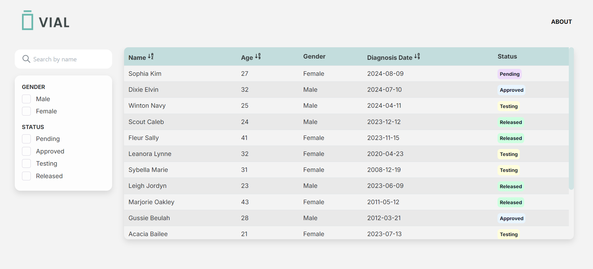

<div align="center">
  
</div>
<H1 align="center">Vial - Subject Grid Display Application</H1>

<p  align="center">This is a Next.js project designed to provide a user-friendly interface for displaying and managing subject data. Built with modern technologies such as React, TypeScript, and Mantine, the application features a responsive grid layout that allows users to view, filter, and sort subject information efficiently.</p>

## 🗺️ Map
[📦 Installation](#installation)

[🔓 Preview](#preview)

[⚙️ Built With](#built-with)

[💡 Features](#features)

## Installation

First, run the development server:

```bash
yarn install
# then
yarn add react react-dom next
# or
yarn dev
```

Open [http://localhost:3000](http://localhost:3000) with your browser to see the result.

## Preview
</li>

## Built With
<ul>
    <li></li>
    <li></li>
    <li></li>
    <li></li>
    <li></li>
    <li></li>
    <li></li>
</ul>

## Features
1. **Data Fetching**:
    - Created a mock API endpoint for subjects or developed a backend service with a GET route to fetch subject data.
    - Each subject contains fields such as ID, Name, Age, Gender, Diagnosis Date, and Status.
    - Introduced a delayed API call to simulate realistic network latency.

2. **Grid Display**:
    - Render subject data in a visually appealing and user-friendly grid or table format.
    - Utilize Mantine for styling to ensure a modern and responsive design.

3. **Filtering Capability**:
    - Allow users to filter subject data based on attributes like Gender, Diagnosis Date, and Status.
    - Provide intuitive UI elements such as dropdowns or checkboxes for filters.

4. **Sorting Feature**:
    - Enable users to sort data by attributes such as Name, Age, and Diagnosis Date.
    - Implement sorting via clickable table headers or separate sorting controls.

5. **Dynamic Interactions**:
    - Add a search bar enabling users to search subjects by their name.
    - Implement infinite scroll to handle the display more efficiently.

6. **Responsiveness**:
    - Application is responsive and provides a good user experience on different devices and screen sizes.

7. **Accessibility**:
    - Adheres to accessibility standards (e.g., WCAG) to provide an inclusive experience for all users.

8. **GitHub Project Board**:
    - Use [GitHub Project Board](https://github.com/users/sophiakim1/projects/2) to manage and track the progress of tasks and features.

<br>
<br>
<p align="center">Thank you for checking out! Hope you find it useful and easy to use. If you have any questions or feedback, please feel free to reach out.🤚</p>